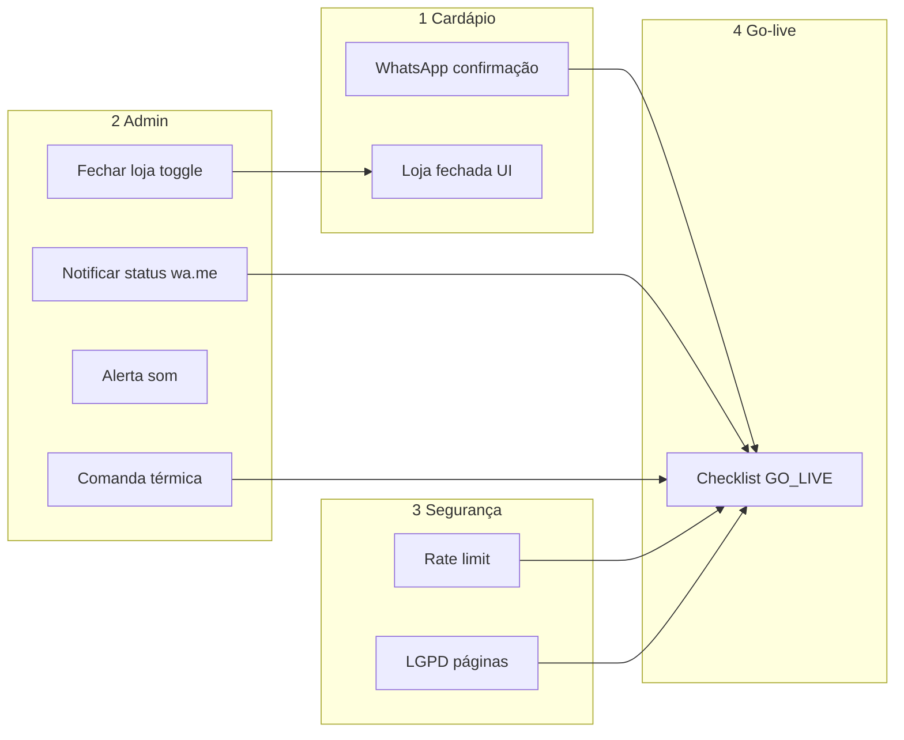

# Plano de execução — Cardápio Nimbus

Organização em **4 categorias**, na ordem que você pediu.  
Cada item tem **ID** para rastrear. Dependências entre categorias estão no final.

**Legenda:** `P0` = indispensável antes do piloto · `P1` = pertinente, também antes do piloto · `P2` = pode esperar após o 1º cliente (fora do gate)

**Regra do piloto:** tudo que você já sabe que precisa — inclusive admin “pertinente” — entra **antes** do primeiro cliente. O piloto serve só para feedback do que não estava no radar.

---

## Ordem recomendada (visão goje)

```text
Fase 1 → Categoria 1 (cardápio mobile + WhatsApp + ocultar menu)
Fase 2 → Categoria 2 (admin completo: operação, kanban, comanda, catálogo, UI, ajuda)
Fase 3 → Categoria 3 (segurança/ops mínimo)
Fase 4 → Categoria 4 (checklist go-live — processo, pouco código)
```

**Por que cardápio antes do admin:** o fluxo do cliente e o `wa.me` na confirmação são o que o piloto sente no dia 1. A Etapa 2 vem logo após 1E e deve estar **100% concluída** antes de enviar o link ao 1º cliente.

---

# 1 — Cardápio digital (foco mobile)

## 1.0 — Navegação e fluxo WhatsApp (decisões de produto)

| ID | Prioridade | Tarefa | Arquivos / notas |
|----|------------|--------|------------------|
| C1-00 | P0 | **Ocultar** menu superior + inferior (`TopNav`, `MobileBottomNav`) via flag/CSS; **não remover** componentes nem rotas `OrdersPage` / `ProfilePage` | `CardapioApp.jsx`, `cardapio.css`, ex.: `lib/cardapioFeatures.js` → `SHOW_LEGACY_NAV = false` |
| C1-01 | P0 | Criar `buildOrderWhatsAppMessage(order, store, customer)` com resumo completo (itens, total, pagamento, endereço, nº pedido) | `lib/storeWhatsApp.js` |
| C1-02 | P0 | Estender `buildStoreWhatsAppOrderUrl` para aceitar mensagem customizada (ou função dedicada `buildSendOrderToStoreUrl`) | `lib/storeWhatsApp.js` |
| C1-03 | P0 | Tela **Pedido enviado**: Pix (chave + **copiar**), instrução comprovante, CTA **Enviar pedido no WhatsApp** (`wa.me` → loja) | `CheckoutModal.jsx`, `cardapio.css` |
| C1-04 | P0 | Remover/substituir CTA **Acompanhar pedido** por WhatsApp como ação principal (manter página Pedidos no código, só inacessível sem menu) | `CheckoutModal.jsx` |
| C1-05 | P1 | Reutilizar mesmo link WhatsApp em toast pós-envio (opcional) | `CardapioContext.jsx` |

**Objeção / alinhamento:** sem API Meta, confirmação para o **cliente** só via botão que abre `wa.me` **da loja para a loja** (cliente envia). Notificação **loja → cliente** fica na **Categoria 2** (admin).

**Dependência:** loja precisa ter `whatsapp` ou `telefone` em Minha loja (já existe) — conferir no onboarding (Cat. 4).

---

## 1.1 — Visual mobile (banner)

| ID | Prioridade | Tarefa | Arquivos / notas |
|----|------------|--------|------------------|
| C1-10 | P0 | Reduzir altura do banner/capa no mobile | `cardapio.css` (`@media` cover) |
| C1-11 | P0 | Remover `border-radius` da capa no mobile | `Cover.jsx` / `cardapio.css` |

---

## 1.2 — Retirada / entrega (tempo de espera)

| ID | Prioridade | Tarefa | Arquivos / notas |
|----|------------|--------|------------------|
| C1-20 | P0 | Exibir tempo configurado em cada opção do mini-card (retirada vs delivery) | `StoreHeader.jsx`, `formatDurationMinutes` + `getEstimateMinutesForOrderTipo` / `storeConfig` |
| C1-21 | P1 | Opcional: repetir tempo na barra de localização (`locSub`) | `CardapioContext.jsx` |

**Dependência:** dados já vêm de Minha loja (`tempoEntregaDelivery` / `tempoEntregaRetirada`) — **sem mudança obrigatória no admin**, só exibir no cardápio.

---

## 1.3 — Seção promoções (home)

| ID | Prioridade | Tarefa | Arquivos / notas |
|----|------------|--------|------------------|
| C1-30 | P0 | Bloco **Promoções** no topo: título com estilo próprio (cor/tamanho) | `ProductSections.jsx` ou `PromoCarouselSection.jsx`, `cardapio.css` |
| C1-31 | P0 | Lista horizontal: ~2,5 cards visíveis, scroll lateral, card vertical (foto maior → nome → descrição → preço riscado + promo verde) | novo componente + CSS |
| C1-32 | P0 | **Não** repetir promoções no grid vertical abaixo (só no carrossel) | `ProductSections.jsx` + `catalogFromStore` / filtro categoria promo |

---

## 1.4 — Sacola em duas etapas (mobile + desktop)

| ID | Prioridade | Tarefa | Arquivos / notas |
|----|------------|--------|------------------|
| C1-40 | P0 | `Ver sacola` → abre **resumo** (itens, totais), não checkout | `MobileSacolaBar.jsx`, novo `CartReviewModal.jsx` ou overlay |
| C1-41 | P0 | Ações no resumo: **Adicionar mais itens** (fecha modal), **Editar** por linha (`editCartItem`), **Finalizar pedido** → `openCheckout()` | `CardapioContext.jsx` |
| C1-42 | P0 | Desktop: alinhar comportamento (sidebar já é resumo; botão hoje “Continuar pedido” → renomear/fluxo igual) | `CartSidebar.jsx` |
| C1-43 | P1 | Ajustar `padding-bottom` do conteúdo sem menu inferior (só barra sacola) | `cardapio.css` |

---

## 1.5 — Checkout / endereço / Pix

| ID | Prioridade | Tarefa | Arquivos / notas |
|----|------------|--------|------------------|
| C1-50 | P0 | Após CEP → endereço: **foco automático** no campo Número | `AddressModal.jsx` ou fluxo pós-`CepModal` |
| C1-51 | P0 | Ponto de referência **sem asterisco** (opcional); validação não exigir `ref` | `AddressModal.jsx`, `confirmAddress` se houver validação |
| C1-52 | P0 | Pix: **não** mostrar bloco da chave no passo de pagamento; só na confirmação final (step 4) se quiser resumo — e **completo** no modal sucesso (C1-03) | `CheckoutModal.jsx` — remover `pixInfoBlock` do step 3 |
| C1-53 | P0 | Botão **Copiar chave Pix** no sucesso | `CheckoutModal.jsx` + `navigator.clipboard` |

---

## 1.6 — UX cardápio (do GO_LIVE, ligado ao cardápio)

| ID | Prioridade | Tarefa | Arquivos / notas |
|----|------------|--------|------------------|
| C1-60 | P0 | `generateMetadata` por `{slug}` (título, descrição, imagem) — preview WhatsApp | `app/(public)/[slug]/page.jsx` |
| C1-61 | P0 | Página amigável slug inexistente | `not-found.jsx` ou rota custom |
| C1-62 | P0 | Loja fechada: mensagem com horário de abertura hoje | `StoreHeader.jsx` / `storeHours.js` |
| C1-63 | P0 | Pedido mínimo + taxa visíveis antes do checkout final | `CartReviewModal` / step 4 |
| C1-64 | P1 | Esconder rota `/cadastro` “Em construção” | `app/(public)/cadastro/page.jsx` redirect ou 404 |

**Dependência C1-62:** se implementar **fechar loja manual** (A2-02), cardápio deve respeitar `loja.aberta` **e** horários — ver Cat. 2.

---

### Lotes sugeridos — Categoria 1

| Lote | IDs | Entrega testável |
|------|-----|------------------|
| **1A** | C1-00, C1-10, C1-11, C1-50, C1-51, C1-52 | Visual + endereço + nav oculto |
| **1B** | C1-40–C1-43 | Fluxo sacola → checkout |
| **1C** | C1-30–C1-32, C1-20 | Promo carousel + tempos entrega |
| **1D** | C1-01–C1-04, C1-03, C1-53 | WhatsApp + sucesso Pix |
| **1E** | C1-60–C1-63 | SEO + fechado + metadados |

---

# 2 — Admin (completo antes do piloto)

Tudo nesta categoria é **gate do 1º cliente**. O piloto não substitui implementação — só revela lacunas novas.

---

## 2.0 — Operação crítica (loja aberta/fechada + alerta)

| ID | Prioridade | Tarefa | Arquivos / notas |
|----|------------|--------|------------------|
| A2-01 | P0 | **Alerta pedido novo:** som + Notification API (pedir permissão ao abrir Pedidos) | `AdminOrdersContext.jsx` ou `AdminShell.jsx` |
| A2-02 | P0 | **Fechar loja agora:** toggle manual persiste `aberta` (empresa + `menu_store_state`) | `AdminSidebar` ou Minha loja + API save |
| A2-03 | P0 | Cardápio e API respeitam `aberta` manual **e** horário — precedência: **manual fechado > horário** | `CardapioContext`, `storeHours.js`, `orderValidation.js`, `public-order` |
| A2-04 | P0 | UI do toggle documenta o comportamento (“ignora horário até reabrir”) | `admin/loja` ou sidebar |

---

## 2.1 — Kanban, tempo e WhatsApp loja → cliente

| ID | Prioridade | Tarefa | Arquivos / notas |
|----|------------|--------|------------------|
| A2-10 | P0 | Kanban: botão **Notificar status** → `wa.me` **cliente** com mensagem por status | `pedidos/page.jsx`, `lib/orderWhatsApp.js` (novo) |
| A2-11 | P0 | Mensagens padrão por status (constante; editável depois) | `lib/orderWhatsApp.js` |
| A2-12 | P0 | Modal detalhe: **Enviar resumo no WhatsApp** (mensagem com nº, itens, total, endereço) | `OrderDetailModal.jsx` |
| A2-13 | P0 | Kanban: tempo **“há X min”** no card do pedido | `pedidos/page.jsx` |
| A2-14 | P0 | Validar/corrigir **arquivar concluídos** + **ver arquivados** (filtro por data) | `pedidos/page.jsx`, `AdminOrdersContext` |

### Mensagens sugeridas (MVP) — `notificar status` (A2-11)

| Status alvo | Exemplo de texto |
|-------------|------------------|
| Pedido recebido | `Olá {nome}! Recebemos seu pedido #{id}. Já estamos preparando.` |
| Em preparo | `Seu pedido #{id} entrou em preparo.` |
| Saiu para entrega | `Seu pedido #{id} saiu para entrega.` |
| Concluído (retirada) | `Seu pedido #{id} está pronto para retirada.` |

---

## 2.2 — Comanda / impressão térmica

Hoje existe `window.print()` sem layout de bobina. Substituir por comanda dedicada.

| ID | Prioridade | Tarefa | Arquivos / notas |
|----|------------|--------|------------------|
| A2-20 | P0 | Componente/template **comanda térmica** (80 mm padrão; mono; itens, adicionais, obs, total, pagamento, entrega) | `components/admin/orders/OrderTicket.jsx` + `orderTicket.css` |
| A2-21 | P0 | `@media print`: esconder chrome do admin; imprimir **só** a comanda | `orderTicket.css`, `admin` layout |
| A2-22 | P0 | **Imprimir** no detalhe do pedido (kanban) usa o template | `OrderDetailModal.jsx`, `pedidos/page.jsx` |
| A2-23 | P0 | **Salvar e imprimir** (novo pedido manual) usa o mesmo template | `NewOrderModal.jsx`, `pedidos/page.jsx` |
| A2-24 | P1 | Opção de largura **58 mm / 80 mm** (Minha loja ou preferência local) | `admin/loja` ou `localStorage` admin |
| A2-25 | P0 | Smoke: imprimir pedido online + pedido manual em impressora térmica real | `GO_LIVE` A4 — não é “semana de teste”, é validação sua antes do link |

**Fora do escopo agora:** impressão automática ao chegar pedido `novo` (avaliar depois do piloto se fizer falta).

---

## 2.3 — Catálogo ágil

| ID | Prioridade | Tarefa | Arquivos / notas |
|----|------------|--------|------------------|
| A2-30 | P0 | **Duplicar produto** (cópia com nome “(cópia)”, mesma categoria/adicionais) | `CatalogManager.jsx` |
| A2-31 | P0 | **Duplicar categoria** (cópia + produtos opcional ou vazia — definir na UI) | `CatalogManager.jsx` |

---

## 2.4 — UI admin consistente

Alinhar telas que hoje ficam “pequenas e centralizadas” ao padrão **Produtos / Adicionais**.

| ID | Prioridade | Tarefa | Arquivos / notas |
|----|------------|--------|------------------|
| A2-40 | P0 | **Promoções:** layout full-width, tipografia e densidade iguais a Produtos | `admin/promocoes`, CSS admin |
| A2-41 | P0 | **Clientes:** idem | `admin/clientes`, CSS admin |
| A2-42 | P0 | **Entrega:** idem | `admin/entrega`, CSS admin |
| A2-43 | P1 | Revisar **Cupons** e **Integrações** na mesma linha visual (se ainda destoarem) | páginas admin + CSS compartilhado |

---

## 2.5 — Ajuda e suporte no painel

| ID | Prioridade | Tarefa | Arquivos / notas |
|----|------------|--------|------------------|
| A2-50 | P0 | **Mini manual in-app** (5 tópicos): receber pedido, status, fechar loja, Pix, entrega | modal ou `/admin/ajuda` |
| A2-51 | P0 | **Contato de suporte** Nimbus visível (footer admin ou ajuda) | `admin/layout.jsx` |
| A2-52 | P1 | Link “Ajuda” na sidebar | `AdminSidebar` |

---

### Dependências — Categoria 2

| Item | Precisa de… |
|------|-------------|
| A2-10 / A2-12 | Telefone do cliente no pedido (já no checkout) |
| A2-03 | A2-02 persistindo `aberta` |
| A2-20–A2-23 | Estrutura de itens do pedido no admin (já existe) |
| C1-62 (banner fechado) | A2-03 para fechamento manual |

**IDs antigos renumerados:** A2-04→A2-10, A2-05→A2-11, A2-06→A2-12, A2-07→A2-13, A2-08→A2-30/31, A2-09→A2-50/51.

---

### Lotes — Categoria 2

| Lote | IDs | Entrega testável |
|------|-----|------------------|
| **2A** | A2-01–A2-04 | Som/notificação; fechar loja; cardápio bloqueia pedido |
| **2B** | A2-10–A2-14 | Notificar status; WhatsApp resumo; “há X min”; arquivados |
| **2C** | A2-20–A2-25 | Comanda 80 mm; imprimir do kanban e do novo pedido; teste térmica |
| **2D** | A2-30, A2-31 | Duplicar produto e categoria |
| **2E** | A2-40–A2-43 | Promoções, Clientes, Entrega (e demais) visuais alinhados |
| **2F** | A2-50–A2-52 | Manual + suporte no admin |

---

# 3 — Segurança e operacionais

| ID | Prioridade | Tarefa | Arquivos / notas |
|----|------------|--------|------------------|
| S3-01 | P0 | Rate limit `POST /api/public-order` | middleware ou na route |
| S3-02 | P0 | Auditoria RLS (`pedidos`, `clientes`, `empresas`) | Supabase migrations/policies |
| S3-03 | P0 | Documentar plano incidente (logs Vercel + health) | `docs/OPS.md` ou seção em GO_LIVE |
| S3-04 | P0 | Backup Supabase confirmado no painel | OPS |
| S3-05 | P1 | `GET /api/health/ready` (query leve Supabase) | nova route |
| S3-06 | P1 | Páginas Privacidade + Termos + links no cardápio/login | `app/(public)/...` |
| S3-07 | P2 | `docs/ENV.md` variáveis Vercel | DOC |

**Dependência:** S3-01 antes de divulgar link amplamente (pode ser paralelo ao fim da Fase 1).

**Não misturar com cardápio UI** — exceto links legais no rodapé (S3-06).

---

# 4 — Checklist go-live por loja

Usar **`docs/GO_LIVE.md`** como checklist mestre. Atualizar quando concluir itens de código:

| ID | Prioridade | Tarefa |
|----|------------|--------|
| G4-01 | P0 | Revisar GO_LIVE bloco A com fluxo WhatsApp (C1-03) no trecho Pix |
| G4-02 | P0 | Adicionar passo: “testar Enviar pedido no WhatsApp” no smoke test |
| G4-03 | P0 | Smoke: notificar status, comanda térmica, duplicar produto (após 2B + 2C + 2D) |
| G4-04 | P0 | Planilha interna slug / domínio / e-mail (tabela Histórico no GO_LIVE) |
| G4-05 | P1 | Roteiro 2ª unidade (já no GO_LIVE) |
| G4-06 | P2 | Bloco D super-admin (radar) |

**Categoria 4 é principalmente processo** — executar quando Cat. 1–3 do piloto estiverem prontos.

---

# Mapa de dependências entre categorias



| Se fizer… | Precisa antes… | Se não… |
|-----------|----------------|---------|
| C1-62 fechado com horário “abre às 18h” | — | OK só com horários |
| Fechar manual (A2-02) | — | Toggle sem efeito no cardápio até A2-03 |
| WhatsApp confirmação (C1-03) | WhatsApp da loja cadastrado | Botão não aparece |
| Notificar cliente (A2-10) | Telefone no pedido | `wa.me` sem número |
| Comanda térmica (A2-20) | Template + `@media print` | Imprime página admin inteira |
| Rate limit (S3-01) | — | Risco spam antes de marketing |
| Metadata WhatsApp (C1-60) | Logo/capa na loja | Preview genérico |

---

# O que ficou de fora deste plano (de propósito)

- API WhatsApp Business (pago)
- Remover código de Pedidos/Perfil/Promo nav
- Ambiente Supabase dev separado
- Sentry / uptime externo
- Super-admin criar loja (radar GO_LIVE D)

---

# Critério “piloto pronto” (resumo)

1. **Cardápio:** lotes 1A–1E concluídos.  
2. **Admin:** lotes 2A–2F concluídos (operação, kanban/WhatsApp, comanda térmica, catálogo, UI, ajuda).  
3. **Segurança:** Etapa 3 mínima (rate limit + RLS revisado).  
4. **Processo:** `GO_LIVE.md` bloco A assinado por você.  

O 1º cliente entra **depois** disso; feedback dele não substitui itens já listados acima.

---

*Atualizar este arquivo quando um lote for concluído (marcar IDs com data na tabela abaixo).*

| Lote | Status | Data |
|------|--------|------|
| 1A | concluído | 2026-05-31 |
| 1B | concluído | 2026-05-31 |
| 1C | concluído | 2026-05-31 |
| 1D | concluído | 2026-05-31 |
| 1E | concluído | 2026-05-31 |
| 2A | concluído | 2026-05-31 |
| 2B | concluído | 2026-05-31 |
| 2C | concluído | 2026-05-31 |
| 2D | concluído | 2026-05-31 |
| 2E | concluído | 2026-05-31 |
| 2F | pendente | |
| S3 | pendente | |
| G4 | pendente | |
